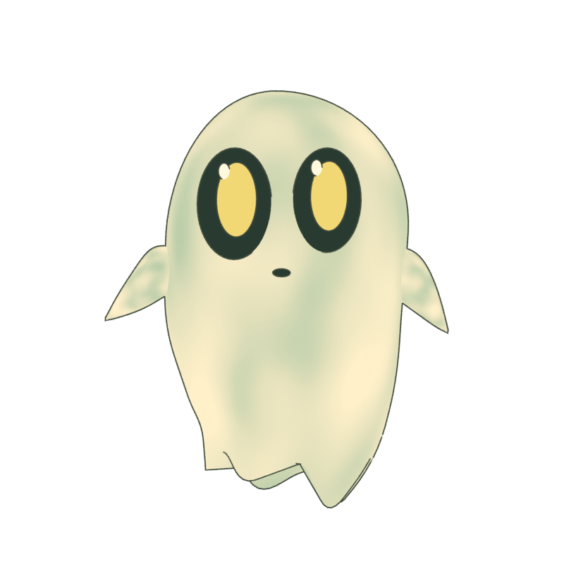
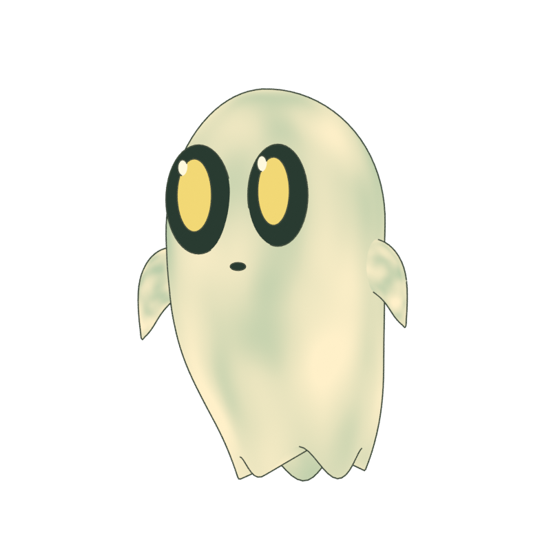
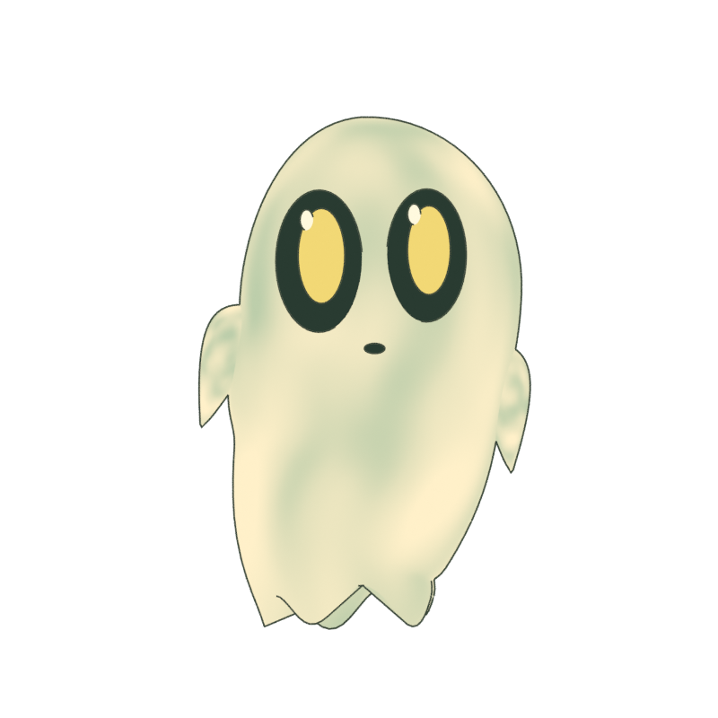
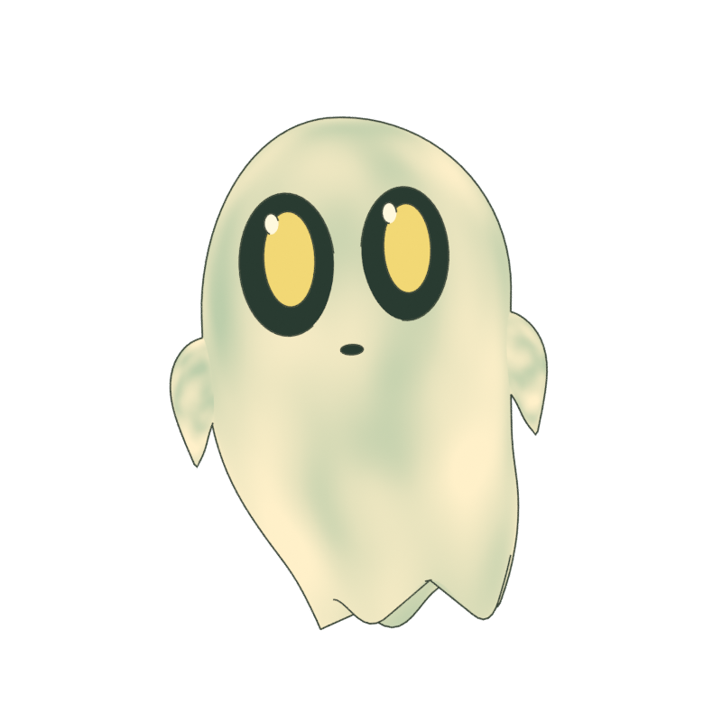
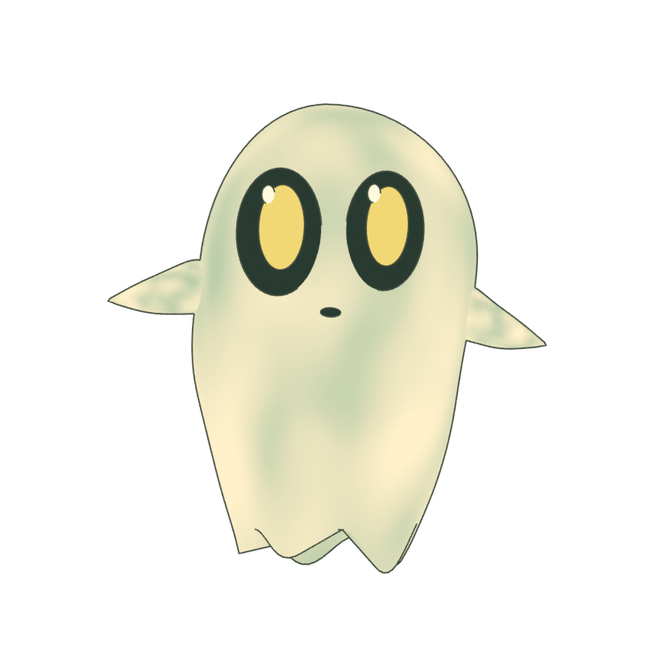
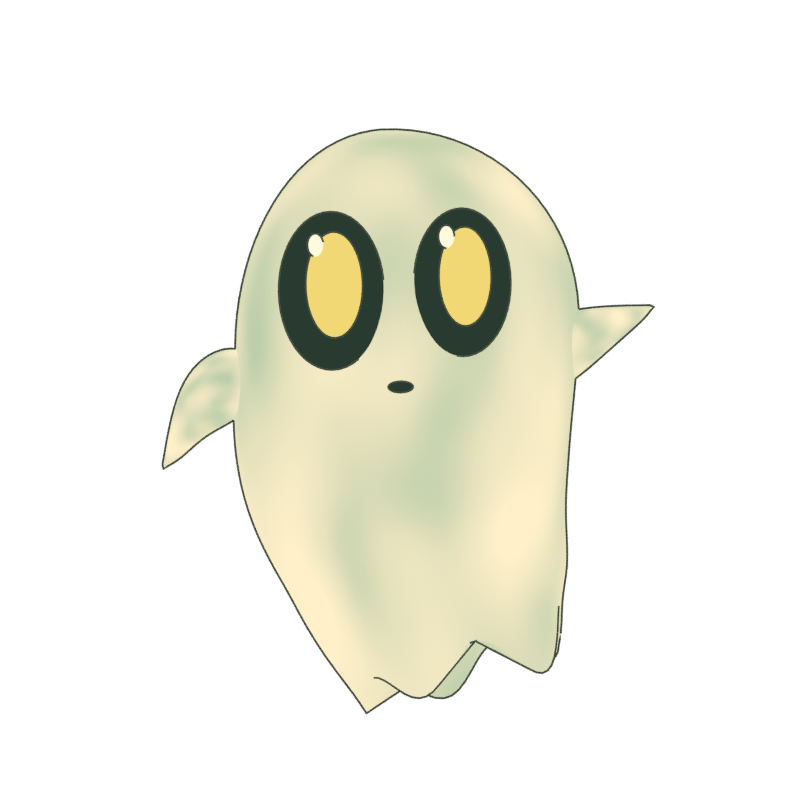

# Boo v2 — modelo e direção do movimento

## Modelo novo

Criado do zero por `tools/blender/build_boo_v2.py`, sem ler, importar ou adaptar a malha v1. A referência é o fantasma ilustrado fornecido pelo usuário e a entrada do storyboard original. A topologia tem coroa assimétrica, centro do corpo curvo, barra ondulada, duas nadadeiras baixas, olhos grandes dourados e nenhuma marca nas bochechas.

- Fonte: `assets/blender/boo-v2.blend`.
- Arquivo carregado pelo site: `public/models/boo-v2.glb` (aproximadamente 792 kB).
- Corpo: 4.241 vértices antes da exportação, com mistura de pesos nas articulações.
- Esqueleto: `root`, `spine`, `head`, `tail`, `tail_tip`, `arm_L`, `hand_L`, `arm_R`, `hand_R`, `eye_L`, `eye_R`.
- Corpo e nadadeiras têm `JOINTS_0` e `WEIGHTS_0`; não são objetos rígidos apenas deslocados pelo canvas.
- Olhos têm pivôs próprios para piscar sem deslocar as outras partes do rosto.

## Poses reais do novo arquivo

As imagens abaixo são renders de revisão do Blender. No navegador, o mesmo modelo recebe o shader de pigmento em tempo real; pequenas diferenças de textura entre render offline e WebGL são esperadas.

| Frente | Três quartos | Saída |
|---|---|---|
|  |  |  |

| Nado A | Nado B | Aceno |
|---|---|---|
|  |  |  |

## Storyboard implementado

O progresso da hero é calculado sobre sua distância sticky. Não se prende a duração de um vídeo.

| Batida | Abertura / corpo | Controle |
|---|---|---|
| 0% | Fenda localizada, somente olhos | Corpo invisível; espera o scroll |
| 3,5–30% | A fenda alarga e a cabeça sobe | `Boo_Emerge`, recorte na borda inferior |
| 30–72,5% | Nadadeiras e corpo atravessam; cauda desenrola | Poses amostradas pelo progresso, sem reprodução irreversível |
| 72,5–100% | Boo livre; a fenda se fecha atrás dele | Transição para flutuação |
| Catálogo | Ocupa o espaço à direita do conteúdo | Âncora `catalogo` |
| Decisão | Cruza para a esquerda da explicação | Âncora `decisao`; nado aumenta durante deslocamento |
| Evidência | Volta à direita, abaixo do fluxo | Âncora `evidencia` |
| Princípios | Retorna à esquerda do título | Âncora `principios` |
| Contato | Chega à direita do convite | Âncora `contato` |
| Scroll reverso | Repete os mesmos pontos ao contrário, até a fenda | Sem gatilhos de execução única |

O tempo autônomo controla apenas vida secundária: flutuação, piscar e nadadeiras. Posição na página e pose de saída pertencem ao scroll. Portanto a rota reverte exatamente; um piscar não precisa retroceder com ela.

## Renderização e leitura

Three.js usa uma câmera ortográfica e materiais sem reflexos. A aquarela é calculada no shader, com manchas amplas e granulação discreta. O contorno invertido também é uma `SkinnedMesh` vinculada ao mesmo esqueleto, para não deixar uma silhueta rígida para trás.

A composição reserva espaços para o Boo no desktop e entre blocos no mobile. O trajeto procura áreas livres; a máscara SVG recorta textos, imagens de produto e controles, inclusive durante scroll rápido. Não colocar um bloco de texto dentro de uma âncora sem atualizar a proteção.

Influência do mouse: até 30 px na horizontal / 22 px na vertical, apenas perto do Boo e fora de texto, links e formulários. Não substitui a trajetória principal e fica desativada em touch. O botão de pausa interrompe animação autônoma; ainda permite deslocamento comandado pelo scroll. Com movimento reduzido, só a imagem estática aparece na hero.

## Verificação

`npm test` valida a reversibilidade da rota, o desvio de leitura, os pesos da malha nova, deformações reais do corpo e das duas nadadeiras nas quatro ações e o fechamento do olho pelo osso. Build, lint e TypeScript são verificações separadas; não comprovam comportamento em todos os dispositivos físicos.

Sem publicação automática. Os artefatos antigos ficam preservados como histórico; nenhum é importado pela implementação atual.
